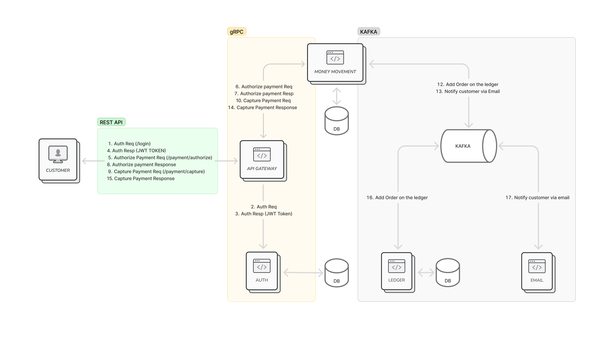

## Microservice Architecture Demo

This repository is a hands-on way to learn about microservice architecture using gRPC and Kafka. It demonstrates service-to-service communication, event-driven workflows, and database integration in a modern distributed system.



## API Gateway Endpoints

All endpoints require requests to include the JWT token in the `Authorization` header after login.
```
# Register customer
curl -X POST -H "Content-Type: application/json" \
  -d '{"first_name": "Happy", "last_name": "Man", "email": "customer@email.com", "password": "SecurePass123!"}' \
  http://localhost:8080/register

# Authenticate user and receive JWT token
curl -X POST -H "Content-Type: application/json" -d '{"email": "customer@email.com", "password": "SecurePass123!"}' http://localhost:8080/login

# Create CUSTOMER account
curl -X POST -H "Authorization: Bearer <JWT_TOKEN>" -H "Content-Type: application/json" \
  -d '{"email_address": "customer@email.com", "wallet_type": "CUSTOMER", "initial_balance_cents": 4000000, "initial_balance_currency": "USD"}' \
  http://localhost:8080/create-account

# Create MERCHANT account
curl -X POST -H "Authorization: Bearer <JWT_TOKEN>" -H "Content-Type: application/json" \
  -d '{"email_address": "merchant@email.com", "wallet_type": "MERCHANT", "initial_balance_cents": 0, "initial_balance_currency": "USD"}' \
  http://localhost:8080/create-account


# Authorize payment
curl -X POST -H "Authorization: Bearer <JWT_TOKEN>" -H "Content-Type: application/json" \
  -d '{"customer_email_address": "customer@email.com", "merchant_email_address": "merchant@email.com", "cents": 1000, "currency": "USD"}' \
  http://localhost:8080/customer/payment/authorize

# Capture payment
curl -X POST -H "Authorization: Bearer <JWT_TOKEN>" -d '{"pid": "<pid>"}' http://localhost:8080/customer/payment/capture


# Check balance
curl -X POST -H "Authorization: Bearer <JWT_TOKEN>" -d '{"customer_email_address": "customer@email.com"}' http://localhost:8080/checkbalance
```


## Transaction Flow

- The user first sends their login credentials through the REST API Gateway, which forwards the request to the Auth service over gRPC. 
- If the authentication is successful, the Auth service responds with a JWT token.
- From then on, the user includes this token in the request header whenever making a transaction call to the API Gateway. 
- The Gateway checks the token’s validity with the Auth service before moving forward.
- Once authorized, the API Gateway passes the transaction request to the Money Movement service over gRPC. 
- This service debits the user’s DEFAULT account and credits the PAYMENT account, recording the transaction in its database.
- At the same time, the Money Movement service produces two event messages to Kafka, which are then consumed by other services. 
- The Ledger service picks up the event and updates its records, while the Email service sends the user a notification about the transaction.
- Finally, the Money Movement service returns a confirmation back to the user indicating that the transaction was successful.


## Local Development with Docker Compose

Requirements:
- Docker
- Docker Compose

```
# Start all services
docker compose up --build --remove-orphans

# login, generate transaction and check balance
bash test_transaction.sh

# Connect to MySQL databases from another container in the same Docker network
docker run -it --network gomicropay_default --rm mysql mysql -hmysql-money-movement -u root -p

# Connect to MySQL databases from your laptop's CLI
docker run -it --network host --rm mysql mysql -h127.0.0.1 -P 33061 -u root -pAdmin123 -e 'select * from auth.registered_users;'
docker run -it --network host --rm mysql mysql -h127.0.0.1 -P 33062 -u root -pAdmin123 -e \
'select * from money_movement.wallet; select * from money_movement.account; select * from money_movement.transaction;'
docker run -it --network host --rm mysql mysql -h127.0.0.1 -P 33063 -u root -pAdmin123 -e 'select * from ledger.ledger;'

# Remove all services
docker compose down --remove-orphans
```

## Deploy, Test and Debug in Kubernetes

Requirements:
- Docker
- Makefile
- Kubernetes (local or remote cluster)
- Kafka (installed via [Strimzi](https://strimzi.io/quickstarts/))

```
# Deploy all services
make deploy-all

# Port-forward API Gateway to localhost:8080
kubectl port-forward service/gateway 8080:8080 -n api-gateway

# Debug MySQL money movement database
kubectl exec -ti mysql-client -n money-movement -- mysql -h mysql-money-movement -u money_movement_user -p
mysql>use money_movement;
mysql>show tables;
mysql>select * from transaction;

kubectl exec -ti mysql-client -n money-movement -- mysql -h mysql-ledger.ledger -u ledger_user -p

# check logs
kubectl logs -l app=gateway -n api-gateway -f
kubectl logs -l app=money-movement -n money-movement -f
kubectl logs -l app=ledger -n ledger -f
kubectl logs -l app=auth -n auth -f
kubectl logs -l app=email -n email -f

# login, generate transaction and check balance
bash test_transaction.sh

# Remove all services
make undeploy-all
```